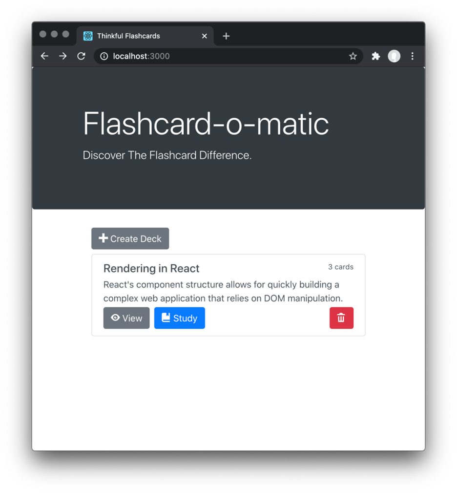

# Flashcard-o-matic

Flashcard-o-matic is an app to help students study online. Teachers can use this application to create decks of flashcards for the subjects they teach.

* Used API calls to create, read, update, and delete records stored by the API.
*	Defined routes and URLs, and used state over multiple components.
*	Built with **JavaScript, React, HTML, and CSS**.

